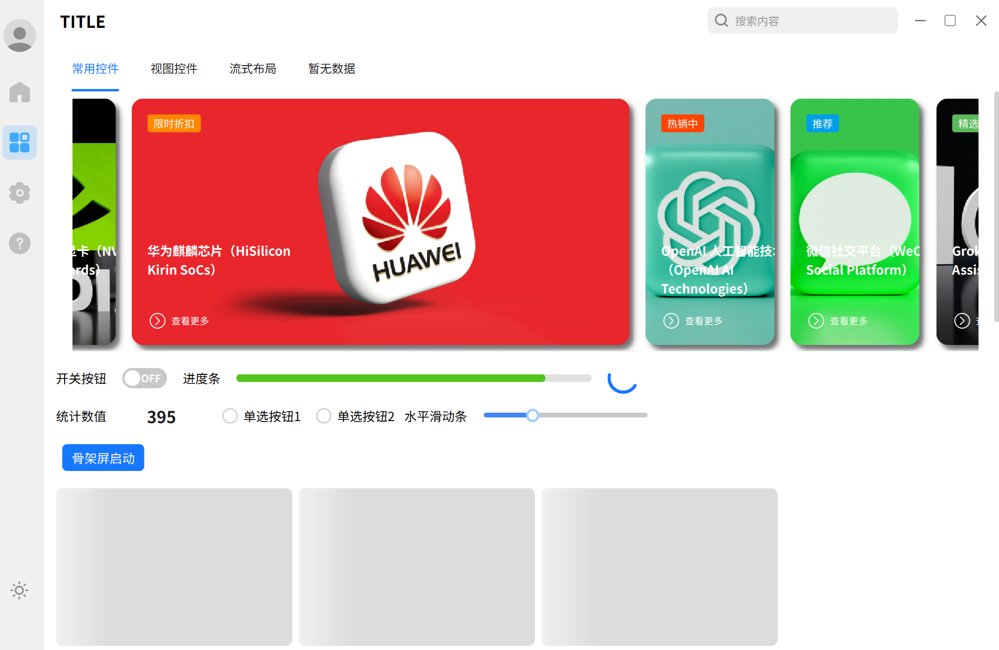

# 🎨 QtAntDesign - Ant Design 风格的 跨平台Qt/C++ UI 库

让 **Qt 应用** 拥有现代化的 **Ant Design 风格**。  
纯 C++ 实现，无需前端技术栈，直接集成到 Qt 项目中。  

  

---

  <b>支持平台</b> 
  
  

---

## ✨ 特性
- 🎯 **Ant Design 风格**：遵循 Ant Design 设计规范，高度还原视觉与交互  
- ⚡ **高性能**：优化渲染和交互，保证 Qt 应用流畅体验  
- ⚡ **纯 C++ / Qt**：无需 QML、JS 或 Web 技术，零依赖前端栈  
- 🧩 **丰富的组件**：拥有大部分常用的 Ant Design 组件
- 🎨 **主题可定制**：支持浅色 / 暗色主题，以及个性化配色  
- 📦 **跨平台支持**：Windows / Linux

---

## 📺 演示视频
- B站观看：[点击这里](https://www.bilibili.com/video/BV1X3ebzTEet/?spm_id_from=333.1387.homepage.video_card.click&vd_source=089d2d18cfa501d509f145660b8bd1e4)
